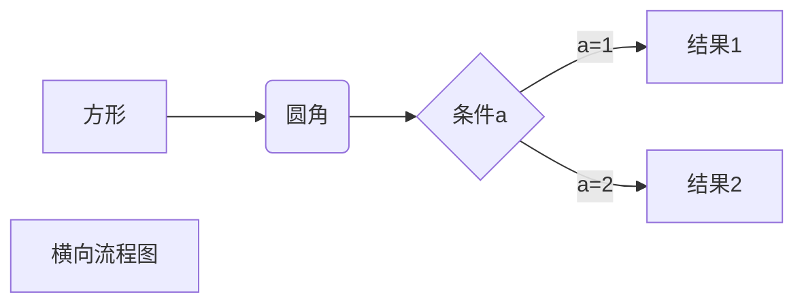

## 前言

总结一下常用的一些MD语法，以及针对于Chirpy主题渲染的一些指令。同时对各个MD Snippets在VSCode、Typora中分别测试一下快捷键和使用。

使用的环境：**本地Typora**、**Web端Jekyll+Chirpy主题**

MD语法教程：<https://www.runoob.com/markdown/md-tutorial.html>

Chirpy [语法讲解](https://chirpy.cotes.page/posts/write-a-new-post/#table-of-contents) [效果](https://chirpy.cotes.page/posts/text-and-typography/)

个人将分别从写法、显示的效果以及快捷方式三个方面进行总结。

## 标题

- **写法**

```markdown
# h1
## h2
### h3
#### h4
```

- **效果**：效果就是这个blog的标题的效果。

- **快捷方式**：个人最喜欢就是`# + 空格`的方式。

## 段落

- **写法**

```markdown
# 一段话
这是一段话  (两个空格)
下一段话

这是一段话
(或者使用空行)
下一段话

# 字体格式
**粗体**
*斜体*
~~删除线~~
<u>下划线</u>
```

- **效果**

  这是一段话  
  下一段话

  **粗体**

  *斜体*

  ~~删除线~~

  <u>下划线</u>

- **快捷方式**：直接打字就行了。在Typora中无需自行补空格。在VSCode中想开启下一行则记住补两个空格，或者中间加一个空行。字体格式常用的是粗体和斜体，快捷键为`Ctrl+B`和`Ctrl+I`. 且基本为各平台公认的快捷键，删除线和下划线根据平台为准。

## 列表

- **写法**

```markdown
# 有序列表
1. list1
2. list2
# 无序列表
- one
- two
# 任务列表
- [ ] task 1
- [x] task 2
# 描述列表\* Chirpy适用：
Sun
: the star around which the earth orbits
Moon
: the natural satellite of the earth, visible by reflected light from the sun
```

- **效果**

  有序列表：

  1. 首先
  2. 第二
  3. 第三

  无序列表：

  - 章节
    - 部分
      - 段楼

  任务列表：

  - [ ] task 1
  - [x] task 2

  描述列表\*：

  Sun

  : the star around which the earth orbits

  Moon

  : the natural satellite of the earth, visible by reflected light from the sun

- **快捷方式**：`数字 + 空格 = 有序`；`- + 空格 = 无序列表`；任务列表我个人设置为了`Ctrl+T`(Typora)，与表格的冲突了(感觉表格使用频率不高，通过工具栏添加)，自己看着办。实现分层效果只要按一下**Tab**即可(顺便吹一下Typora在列表的交互逻辑真的非常棒，无论是想加一个列表，还是列表终止，还是列表继续，还是分层，使用都非常方便)。

## 链接

- **写法**：

```markdown
纯URL：<https://olimiya.github.io/>
文字上加超链接: [Olimi](https://olimiya.github.io/)
使用链接变量（如果同一个链接使用很多遍，可以使用一个变量来定义该链接）：
[Olimi][1]
[1]:https://olimiya.github.io/（这句话是看不见的）
```

- **效果**：
  纯URL: <https://olimiya.github.io/>
  文字上加超链接：[Olimi](https://olimiya.github.io/)

  链接变量：[Olimi][1]

  [1]:https://olimiya.github.io/

- **快捷方式**：先复制链接。在Typora中`Ctrl+K`粘贴链接，并输入文字（默认为文字加超链接）；在VSCode中先输入文字，然后选中文字`Ctrl+V`(在**Markdown All in One**的插件支持下)。

## 代码

- **写法**

````makefile
# 代码块
```cpp
int main()
{
    return 0;
}
```
# 内联代码
`hello，world!`
# 内联代码：突出强度文件路径 *
`/path/to/a/file.extend`{: .filepath}
````

- **效果**

```cpp
int main()
{
    return 0;
}
```

`hello，world!`

`/path/to/a/file.extend`{: .filepath}（Chirpy主题）

- **快捷方式**：Typora中，使用`Ctrl+Shift+B`添加代码块，Ctrl+Shift+\`设为内联代码(这个快捷键感觉不太好按，一般还是直接打\`)；在VSCode中，可以使用`code`关键字，或者打\`\`\`后自动弹出语言选择(docs-markdown插件)。

## 表格

- **写法**：

```markdown
省略。。手打也太难了。参考一下即可：
| Column1 | Column2 |
| ------- | ------- |
| Row1    | test    |
| Row2    | aaa     |
| Row3    | bb      |
| Row4    | cc      |
```

- **效果**：

| Column1 | Column2 |
| ------- | ------- |
| Row1    | test    |
| Row2    | aaa     |
| Row3    | bb      |
| Row4    | cc      |

- **快捷方式**：`Ctrl+T`,Typora默认快捷键。VSCode在**docs-markdown**插件支持下可自定义快捷键。

## 图片

- **写法**：

```markdown

如：
* Chirpy. 程序窗口的截图可以考虑显示阴影效果，在light模式下会看到阴影：
{: .shadow }
test next
```

- **效果**：
  
  {: .shadow }

- **快捷方式**：可以看到与普通链接区别就在于前面多了一个`!`，所以操作基本与普通链接一样即可。

**特殊**：对于图片处理，在写MD时算是一个比较大的问题，因为根据上述的语法，添加图片需要一个url(比如我上面用的是互联网上随便找的一个url)，但是自己写的时候，比如随便截的一个图，如何获取url呢。

**一个思路是将图片保存到本地(比如写的文章的同级目录)然后使用局部路径索引的URL。**

这个思路有两个不足，其一是对每张图片都要手动保存，较为麻烦，能否**直接读取粘贴板**；第二是局部的URL在文章发布时，图片索引的那个局部URL肯定是不对的，怎么将图片也一同**发布到互联网可索引到的URL**。

针对第一个问题，提供两个平台的解决方案：

第一，使用**Typora**，对于粘贴板的图片直接粘贴即可，可选地自动将图片保存到文章同级目录或TEMP目录或文章目录下新建的一个$(filename).assets目录等。第二，使用**VSCode+Paste Image**插件，使用`Ctrl+alt+v`粘贴图片(默认)，同样会自动把图片拷贝到当前目录，可对保存路径、插入路径等进行设置，详细设置在工具贴中再进行介绍。

针对第二个问题，这里也提两个解决方案：

第一，**博客部署的相对路径**。主要是针对写的文章是要发布到个人博客网站上去的，写的文章也处于博客项目的路径中(比如使用Hexo框架或Jekyll框架等)。这时图片保存到框架中特定目录，如assets/img中，即可随同文章一同发布。

第二，使用**Typora+PicGo+图床**。详细的配置这里省略。主要过程是，首先使用本地图片，在发布时，一键将图片上传至图床(个人使用Github)，然后引用图床的互联网可访问URL。

// TODO：
上述写得太啰嗦了..不应该放在MD语法教程中展开，需要整理放入一个工具贴中。

## 媒体资源

即视频、音频等，主流方法有几种：使用HTML标签或直接当做链接进行引用。

把视频、音频等直接复制，粘贴在typora中会自动形成html代码。示例：

<audio src="https://picbed.olimi.icu/vedio/%E8%A1%80%E5%8E%8B%E6%8F%90%E5%8D%87%E5%89%82.mp3"></audio>

<video src="https://picbed.olimi.icu/vedio/5_6275903352190534701.mp4"></video>

视频的话可以使用以下两种语法：

```html
<video src="视频链接"></video>
```

```html
<iframe height=498 width=510 src="视频链接">
```

## 引用(Quote)

- 写法

```markdown
> block
> 引用内容
```

- 效果：

> 引用内容
>
> 支持嵌套，以及和列表等一起使用
>
> > 内层引用
>
> 1. 第一
> 2. 第二

- 快捷方式：`>`加一个空格，实现嵌套使用**Tab**.

## 提示(Prompt)\*

这个是基于引用的Block实现的，属于Chirpy对Block渲染的一种优化显示而已，

- **写法**

```markdown
> Example line for prompt.
{: .prompt-info }
(可选prompt-tip、prompt-info、prompt-warning、prompt-danger)
```

- **效果**（普通MD看不出来啦，要在Chirpy主题中渲染才会显示效果）：

> Example line for prompt.
{: .prompt-tip }

> Example line for prompt.
{: .prompt-info }

> Example line for prompt.
{: .prompt-warning }

> Example line for prompt.
{: .prompt-danger }

- 快捷方式：与引用基本一致。

## 眉批(Front Matter)\*

- **写法**

```markdown
---
title: Markdown语法及测试 # 标题 （使用时将注释删除）
date: 2022-04-20 21:02:58 +0800 # 时间
categories: [TOP_CATEGORIE, SUB_CATEGORIE] # 分类，最大两层
tags: [TAG]     # TAG names should always be lowercase，可以有无数个标签
description: . # 描述
author: # 作者信息
  name: Full Name
  link: https://example.com
toc: false # 关闭目录
comments: false # 关闭评论
math: true # 加载数学功能
mermaid: true # 启用Mermaid
pin: true # 置顶帖子

---
```

为[**yaml**语法](https://www.runoob.com/w3cnote/yaml-intro.html)(缩进表示层次关系)，是用于标识该MD文件的元参数。便于博客框架识别文章的相关描述和属性配置。这里标注的属性特指在**Jekyll框架**中使用的。

## 脚注

- **写法**

```markdown
"从前有座山，山里有个和尚。"[^Olimi]
[^Olimi]: Olimi是个童话故事作家。（既然说是脚注，这个注释一般放在文章最后，有的MD渲染器会自动放到最后）
```

- **效果**

  "从前有座山，山里有个和尚。"[^Olimi]

  [^Olimi]: Olimi是个童话故事作家。

- **快捷方式**：这个语法本质上跟前面定义的**链接变量**一样，使用`[]`定义一个变量。用的不多，用的时候手动打即可。Typora中工具栏有这个命令。

## 数学

使用 [KaTeX](https://github.com/Khan/KaTeX) 或者 [MathJax](https://github.com/mathjax/MathJax) 来渲染数学表达式。

- **写法**

```markdown
# 内联公式
$x+y$
# 公式块
$$
\begin{Bmatrix}
   a & b \\
   c & d
\end{Bmatrix}
$$
$$
\begin{CD}
   A @>a>> B \\
@VbVV @AAcA \\
   C @= D
\end{CD}
$$
```

- **效果**：$X+Y$

$$
\begin{Bmatrix}
   a & b \\
   c & d
\end{Bmatrix}
$$

$$
\begin{CD}
   A @>a>> B \\
@VbVV @AAcA \\
   C @= D
\end{CD}
$$

- **快捷方式**：直接打`$`。

## 技巧

- **HTML元素**：不在 Markdown 涵盖范围之内的标签，都可以直接在文档里面用 HTML 撰写。如：

```markdown
使用 <kbd>Ctrl</kbd>+<kbd>Alt</kbd>+<kbd>Del</kbd> 重启电脑
```

​	使用 <kbd>Ctrl</kbd>+<kbd>Alt</kbd>+<kbd>Del</kbd> 重启电脑.

- **转义**：Markdown 使用了很多特殊符号来表示特定的意义，如果需要显示特定的符号则需要使用转义字符，Markdown 使用**反斜杠**(\\)转义特殊字符。如：

  ```markdown
  **文本加粗** 
  \*\* 正常显示星号 \*\*
  ```

​	**文本加粗**  

​	\*\* 正常显示星号 \*\*.

​	需要转义的字符包括：

```markdown
\   反斜线
`   反引号
*   星号
_   下划线
{}  花括号
[]  方括号
()  小括号
#   井字号
+   加号
-   减号
.   英文句点
!   感叹号
```

## Mermaid

Mermaid是图表生成工具，可以用来绘制流程图、时序图、甘特等。

- **写法**，类似于代码块。Chirpy中要渲染需要开启Mermaid:true。

~~~markdown
横向流程图

~~~

- 效果：


更多的示例参考：<https://www.runoob.com/markdown/md-advance.html>

## 小结

总结过程时间有点紧张，并不是每个语法都进行了深入研究和使用，部分语法平时用的较少(集中在后面集中高级语法)。

形成文章较为粗糙，在后续使用过程将完善和补充。
